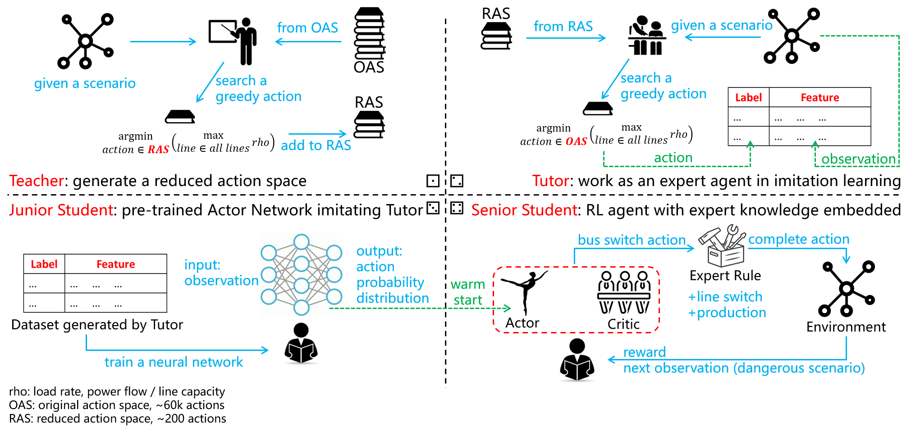

# NeurIPS Competition 2020: Learning to Run a Power Network (L2RPN) - Robustness Track

## Background
This is a repository for the L2RPN competition (NeurIPS 2020, Track 1). The solution based on this repository ranks 2nd in the competition. For more detail, please see:  
[Competition Homepage](https://competitions.codalab.org/competitions/25426)  
[Competition Results](https://competitions.codalab.org/competitions/25426#results)

## Summary
The L2RPN competition calls for solutions of power grid dispatch based on Reinforcement Learning (RL). According to the game rules, three categories of actions can be implemented to realize the power grid dispatch: **substation switch**, **line switch**, and **generator production**. The first two control the grid topology, while the last one controls the grid injection.  
For "line switch" action, it is always beneficial to reconnect a transmission line in most cases. Thus, "line switch" action is determined by the expert experience in our solution.  
For "generator production" action, we find its costs are far more than the payoffs brought in almost all cases, since the production modification to the power contract should be compensated. **It is not an economic dispatch problem!** Thus, production redispatch is excluded in our solution.  
That is to say, our RL agent considers topology control only. Even so, there are still two challenges to obtain a well-performed agent:

* Humongous action space  
The action space involves the combination explosion issue. In this competition, there are more than 60k legal "substation switch" actions. It is almost impossible for the RL agent to learn knowledge from such a huge action space.
* Strongly constrained game  
To some extent, a power system is a fragile system: any mistake in dispatch may lead to a cascading failure (**blackout**), which means a game over in the competition. It decides the RL agent is hard to learn from the early random exploration, because it probably finds almost all actions lead to a negative reward!  

To deal with the above two issues, we propose a "*Teacher-Tutor-Junior Student-Senior Student*" framework in our solution.



+ Teacher: action space generation  
*Teacher* is a strategy that finds a greedy action to minimize the maximum load rate (power flow/capacity) of all lines through enumurating all possible actions (~60k). Obviously, it is a time-consuming expert strategy.  
By calling *Teacher* Strategy in thousands of scenarios, we obtain an action library consisting of actions chosen in different scenarios. In the following procedure, we treat this action library as the action space.  
In our final solution, we filter out some actions that occur less frequently, and the size of final action library is 208. It well solves the issue of **humongous action space**.
+ Tutor: expert agent  
*Tutor* is also a greedy strategy similar to *Teacher*, the difference is that its search space is the reduced action space (208 in our solution), rather than the original action space. As a result, *Tutor* has a far higher decision-making speed. **In this competition, the *Tutor* strategy can achieve a score of 40~45.**
+ Junior Student: imitation learning  
To address the second challenge, we pre-train a neural network whose input is observation and output is probability distribution of all actions (i.e., *Actor*), to imitate the expert agent *Tutor*. We call this agent as *Junior Student*.  
Specifically, we feed *Tutor* different observations, and obtain corresponding greedy actions. Then, construct the labels by setting the probability of the chosen action as 1 while others as 0. Finally, train the neural network in a supervised learning manner, with the dataset in the form of (*feature*: observation, *label*: action probability).  
In our solution, the top-1 accuracy of *Junior Student* reaches 30%, while top-20 accuracy reaches 90%. **The *Junior Student* strategy can achieve a score of ~40 in the competition.**
+ Senior Student: reinforcement learning  
To achieve a better performance than *Tutor*, we build a **PPO** model named *Senior Student*, whose **Actor Network** is copied from *Junior Student*.  
Different from *Tutor* considers the short-term reward only, *Senior Student* focuses on the long-term reward and therefore performs better in the competition. **The *Senior Student* strategy can achieve a score of ~50**.  
It is worth noting that ***Senior Student* faces a risk of overfitting**.

See more technical details in this [video](https://drive.google.com/file/d/1dnq-QgpAVMpWuSQRZPrVzunIkaae7SGW/preview) (released, click to see).

## Usage
If you just want to see the final results, go to step 5 directly. **Tuned model** has been provided.  
* step 1. Teacher Module: generate action space  
  Go to `./Teacher/` and run `Teacher1.py` and `Teacher2.py` for enough long time. 
  
  ```
  cd ./Teacher
  python Teacher1.py
  python Teacher2.py
  ```
  Then, two csv files are generated. Afterward, run `Generate_action_space.py` to generate action space as .npy file at `./ActionSpace/`.
  ```
  python Generate_action_space.py
  ```
  
* step 2. Tutor Module: an expert agent  
  Go to `./Tutor/` and run `Generate_teaching_dataset.py` which calls **Tutor** to generate a dataset recording its observation and action. 
  ```
  cd ./Tutor
  python Generate_teaching_dataset.py
  ```

* step 3. JuniorStudent Module: imitation to Tutor  
  Go to `./JuniorStudent/` and run `JuniorStudent.py` to fit the dataset generated in step.2. It should run with an argument: 'Train' for dataset fitting, 'Test' for accuracy measurement, and 'Convert' for converting the tf model to that recongnized by **Senior Student**. Task-Train and task-Convert are necessary.  
  ```
  cd ./JuniorStudent
  python JuniorStudent.py Train
  python JuniorStudent.py Convert
  ```

* step 4. SeniorStudent Module: RL agent training  
  Go to `./SeniorStudent/` and run `SeniorStudent.py` to train the RL agent, whose model files during the training process are saved at `./SeniorStudent/ckpt/`. Choose a model with good performance to cover the baseline model in `./submission/ppo-ckpt/`.  
  ```
  cd ./SeniorStudent
  python SeniorStudent.py
  ```

* step 5. Performance Test  
  Run `runner.py` to test the trained agent's performance on the off-line dataset. 
  ```
  python runner.py
  ```

If you want to see its on-line performance, make the zip file of `./submission/` according to [L2RPN-Competition's guidance](https://competitions.codalab.org/competitions/25426#learn_the_details-evaluation), and submit it at [the website](https://competitions.codalab.org/competitions/25426#participate).  

## Environment Requirement
```
grid2op>=1.2.3
tensorflow>=2.3.0
numpy>=1.19.2
numba>=0.48.0
scipy>=1.4.1
pandas>=1.1.3
pandapower>=2.2.2
```

## Extra Tips
+ Tutorials for Grid2op  
Grid2op environment is somehow complex, some tutorials are provided by [@Benjamin D.](https://github.com/BDonnot) in the form of Jupyter Notebooks [here](https://github.com/rte-france/Grid2Op/tree/master/getting_started).
+ Acclerate Power Flow Calculation  
Noticed the main computational burden lies in "power flow calculation", it is better to install [Lightsim2grid](https://github.com/BDonnot/lightsim2grid) which is ~10 times faster than default pandapower backend. It helps accelerate training effectively.
+ Improve Neural Network Implementation  
In our solution, the neural network is implemented naively: we just send the original observation to a full-connected network. More advanced skills such as **graph convolution network** and **attention mechanism** are recommended to improve the performance.
+ Improve Sampling Efficiency  
Noticed the sampling time is much longer than the updating time of neural networks, soft actor-critic (SAC) which is **off-policy** can be trained to replace the proximal policy optimization (PPO) in the current solution. It will improve sampling efficiency significantly, which further accelerates training.


## License Information
Copyright (c) 2020 EI Innovation Lab, Huawei Cloud, Huawei Technologies   
The code is subject to the terms of [Mozilla Public License (MPL) v2.0](https://www.mozilla.org/en-US/MPL/2.0/).  
Commercial use is **NOT** allowed.
